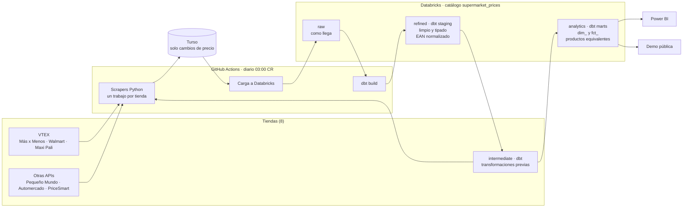

# Arquitectura

Comparador histórico de precios de supermercados de Costa Rica. Cada día se descarga el catálogo de
ocho tiendas, se guarda el historial de cambios y se transforma en un modelo listo para analizar.

Estado: `raw`, `refined` (staging), `intermediate` y `analytics` están hechas, con el cruce de productos por código
de barras, la comparación de precios y el historial diario. El cruce por nombre (Automercado, PriceSmart y Pequeño
Mundo), Power BI y la demo pública están pendientes.

## Decisiones

- **Un trabajo por tienda, en paralelo.** Si un sitio falla, las otras siguen. Cada una termina en rojo
  si su descarga no queda completa.
- **Turso guarda solo cambios.** Una fila nueva en `prices` únicamente cuando cambia el precio, el
  precio de lista o la disponibilidad. Así el historial crece poco.
- **Databricks se carga desde Turso, no desde cada tienda.** Un único proceso escribe en Delta; ocho
  escribiendo a la vez en las mismas tablas chocarían.
- **La carga a Databricks y dbt son trabajos aparte**: si fallan, las descargas ya hechas
  no se pierden, pero la corrida sale en rojo y llega el aviso por correo.
- **Capas y convención de dbt.** Cada capa de dbt tiene su esquema en el catálogo `supermarket_prices`:
  `raw` es una copia fiel de Turso (fechas como texto, ids de Turso); `refined` es *staging* (modelos
  `stg_turso__*`, uno por tabla: renombrar, tipar, limpiar); `intermediate` guarda las transformaciones
  previas (`int_*`) que hagan falta para llegar a los marts; `analytics` son los *marts* (`dim_*` y `fct_*`),
  los que consume Power BI.
- **Clave de cruce entre tiendas: código de barras normalizado.** Sin ceros a la izquierda y
  rellenado a 14 dígitos (GTIN-14). Los códigos de menos de 8 dígitos son de balanza (frutas y
  verduras), no códigos de barras. Automercado, PriceSmart y Pequeño Mundo no publican código de
  barras: se cruzarán por nombre, marca y tamaño.
- **Calidad.** dbt corre pruebas de unicidad, nulos y llaves foráneas, más tres pruebas propias
  (precios no negativos, forma de la clave de código de barras y aviso si la última descarga de una
  tienda no quedó `ok`).
- **Historial diario.** Turso guarda solo cambios, pero para graficar hace falta un precio por día. `int_prices__validity`
  calcula el rango de días en que estuvo vigente cada precio y `fct_daily_prices` lo cruza con el calendario
  `all_dates`. Un producto deja de aparecer el día en que se ve por última vez en el catálogo.
- **Seeds.** Datos de apoyo escritos a mano en CSV (`dbt/seeds/`): tipo de tienda, mapa de categorías unificadas,
  equivalencias de marca y decisiones manuales sobre el cruce de productos.
