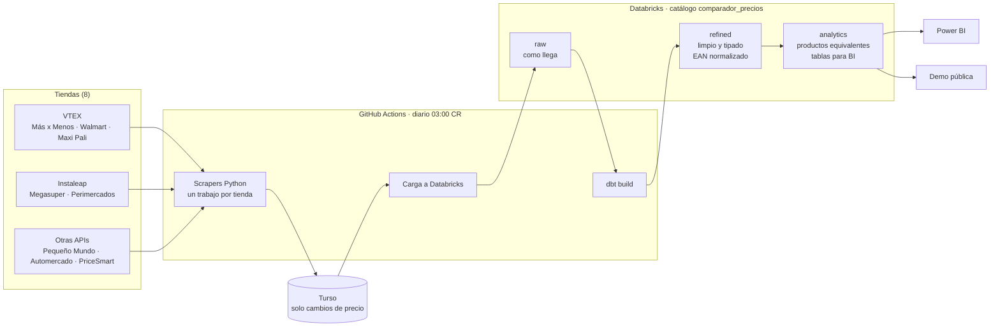

# Arquitectura

Comparador histórico de precios de supermercados de Costa Rica. Cada día se descarga el catálogo de
ocho tiendas, se guarda el historial de cambios y se transforma en un modelo listo para analizar.

Estado: las capas `raw` y `refined` están hechas. `analytics`, Power BI y la demo pública están pendientes.

## Decisiones

- **Un trabajo por tienda, en paralelo.** Si un sitio falla, las otras siguen. Cada una termina en rojo
  si su descarga no queda completa.
- **Turso guarda solo cambios.** Una fila nueva en `prices` únicamente cuando cambia el precio, el
  precio de lista o la disponibilidad. Así el historial crece poco.
- **Databricks se carga desde Turso, no desde cada tienda.** Un único proceso escribe en Delta; ocho
  escribiendo a la vez en las mismas tablas chocarían.
- **La carga a Databricks y dbt son pasos extra** (`continue-on-error`): si fallan, la descarga diaria
  no se pierde.
- **Capas.** `raw` es una copia fiel (fechas como texto, ids de Turso). `refined` tipa, renombra y
  normaliza. `analytics` combina tiendas.
- **Clave de cruce entre tiendas: código de barras normalizado.** Sin ceros a la izquierda y
  rellenado a 14 dígitos (GTIN-14). Los códigos de menos de 8 dígitos son de balanza (frutas y
  verduras), no códigos de barras. Automercado, PriceSmart y Pequeño Mundo no publican código de
  barras: se cruzarán por nombre, marca y tamaño.
- **Calidad.** dbt corre pruebas de unicidad, nulos y llaves foráneas, más tres pruebas propias
  (precios no negativos, forma de la clave de código de barras y aviso si la última descarga de una
  tienda no quedó `ok`).
